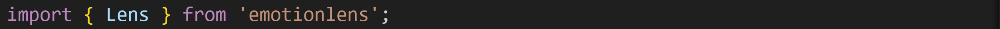
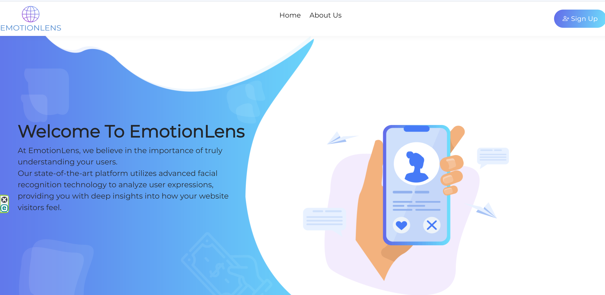
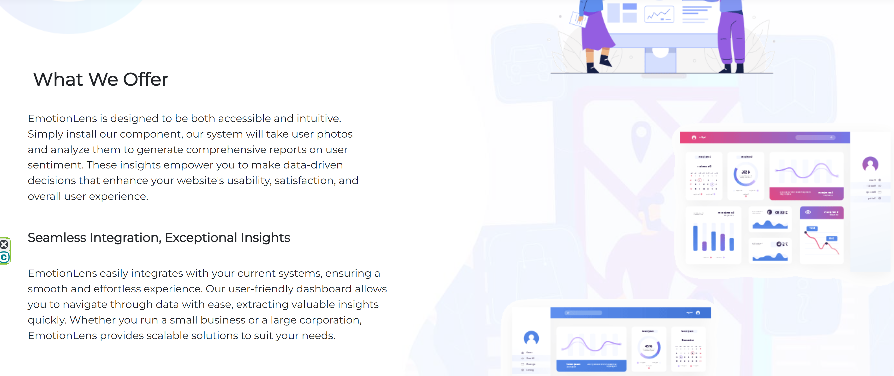
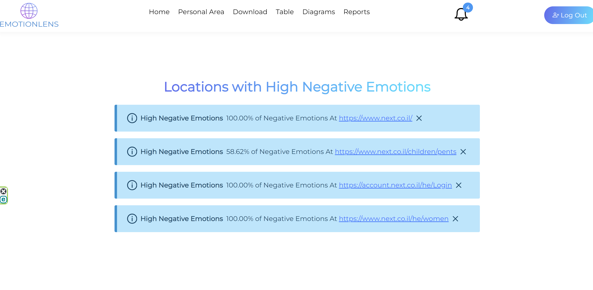

# EmotionLens

> **Note:** This repository does not include source code as this project may become a startup.
A detailed presentation about the project is attached.

## Project Overview

EmotionLens is an advanced platform that leverages AI to analyze the facial expressions of users in real time while they browse a website. It provides website owners with valuable insights into user satisfaction and emotional engagement, allowing businesses to make data-driven decisions to enhance user experiences.

### Key Features:
- **Real-Time Emotion Detection**: Uses AI to analyze facial expressions from live user interactions.
- **Embeddable Component**: Simple integration via an [npm package](https://www.npmjs.com/package/emotionlens), enabling effortless setup on any website.
- **Routing and Image Tracking**: Captures both the user's facial expression and the page on which it was taken.
- **Secure Data Processing**: Images and routes are securely transmitted to the server, processed, and analyzed.
- **Personalized Dashboard**: Website owners can access emotion analysis results via a secure personal dashboard.

## How EmotionLens Works

1. **Frontend Lens Component**:
   - The website owner embeds the lens component on selected pages.
   - The component captures the user's facial expression every few seconds via the user's camera.
   - Simultaneously, the component tracks the page where the user is currently located.
   - Captured images are sent securely to the server for emotion analysis.   

2. **Backend Processing**:
   - The backend, developed in Python, processes incoming images and page routes.
   - It uses AI models to classify emotions based on facial expressions and stores the results in a MySQL database.
   - The backend also handles user management, ensuring secure login and data access for clients.

## How to Use the Lens Component

1. Install the lens component on your website using the [npm package](https://www.npmjs.com/package/emotionlens).
2. Add the component to the pages where you want to analyze the user experience.
3. Configure the frequency of image capture based on your needs.
4. Securely send captured images and routing data to the server for analysis.

### Technologies Used
- **Frontend**: React (TypeScript, Bootstrap, PrimeReact)
- **Backend**: Python (Flask)
- **Database**: MySQL
- **AI Model**: Facial emotion recognition using OpenCV and deep learning models

## Security and Privacy

- EmotionLens prioritizes privacy: images are processed and not stored long-term.
- All data transfers are secure, and user privacy is protected.
- The personal dashboard is secured, ensuring only authorized users can access the analysis results.

## Future Development

The platform is currently in the development phase. We are working towards launching this as a commercial product, offering AI-powered emotion analytics for websites.

## Project Presentation

A **detailed presentation** about the project is attached, providing further insights into EmotionLens' concept, features, and future plans.

---

Stay tuned for updates on the progress of EmotionLens!

---

### Contact

For more information or inquiries, please reach out to the EmotionLens team at [emotienlens.help@gmail.com].

### Snashpots

